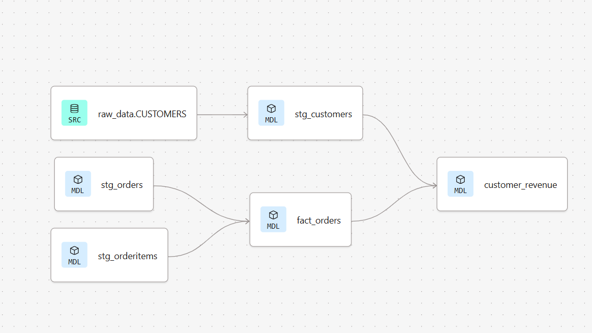
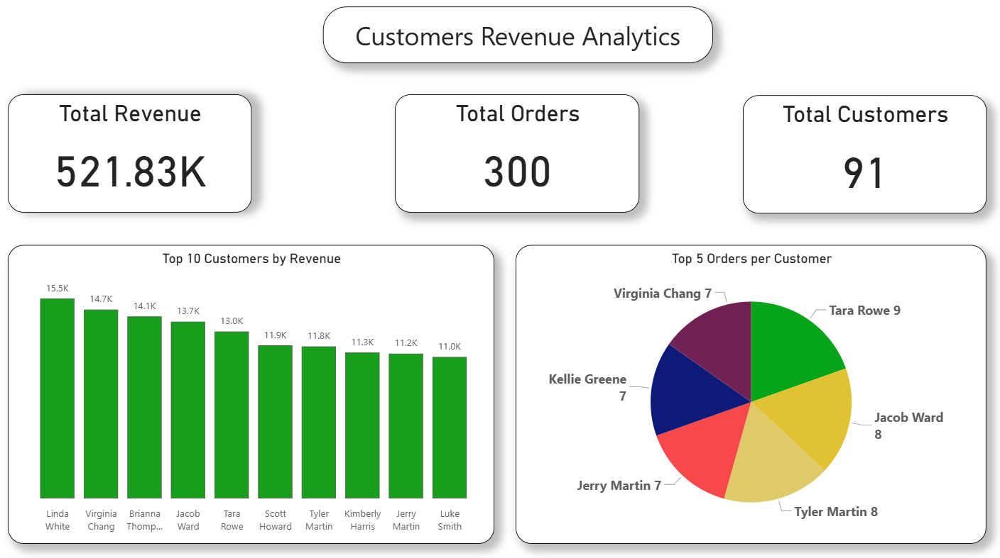

# OMS dbt Project

This repository contains a dbt project for the Order Management System (OMS). using dbt-cloud to transform and clean data in snowflake cloud data warehouse. and create a customer revenue report using Power BI.

## Data Used
- [orders managment system data](project-data)

**Project Structure**
- `models/` — dbt models and sources
	- `staging/` — staging models: `stg_customers.sql`, `stg_orderitems.sql`, `stg_orders.sql`
	- `Facts/` — fact tables: `fact_orders.sql`
	- `marts/` — marts and aggregated models: `customer_revenue.sql`

**Key Models**
- `stg_customers` — cleans and standardizes customer data
- `stg_orders` — raw orders ingested and normalized
- `stg_orderitems` — individual order line items
- `fact_orders` — fact table for order-level analytics
- `customer_revenue` — aggregated revenue metrics per customer

**Data Lineage diagram**

**OMS Dashboard preview**

**Customers Revenue Analytics (PBIX)** 

[Customers-Revenue-Analytics.pbix](Images/Customers-Revenue-Analytics.pbix)

